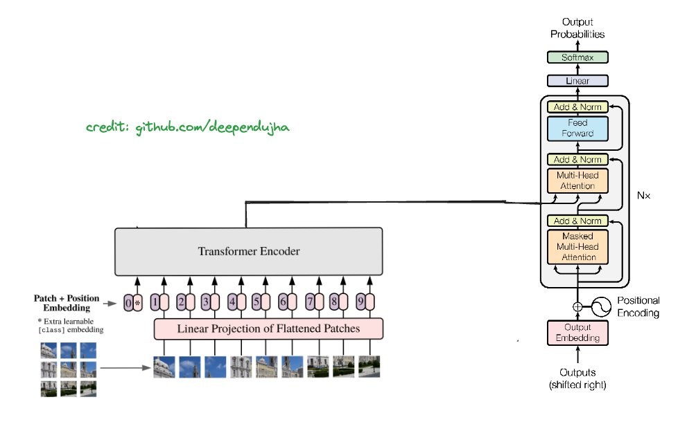
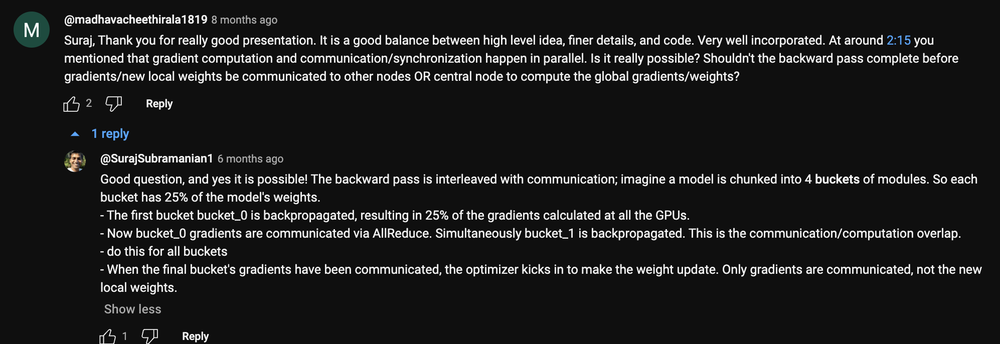
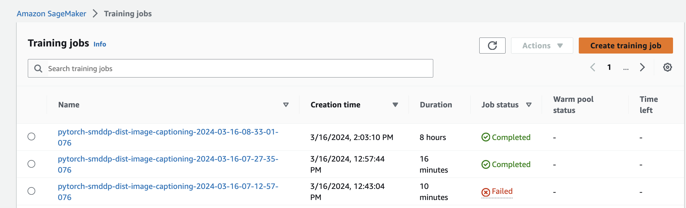
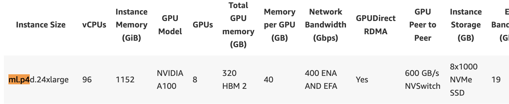
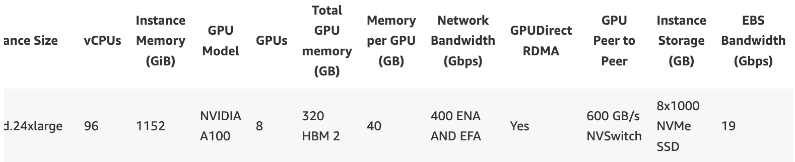
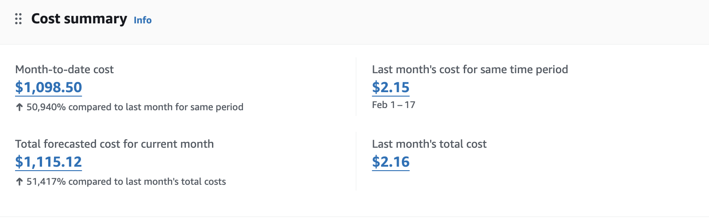

# Image Captioning (`Vision to Text`)

---

## Description

- Model trained on dataset of size 9 GB+

- Number of parameters in the encoder model: 33675264

- Number of parameters in the decoder model: 78113381

- Total number of parameters: 111788645

- [Check out a detailed thread on this project](https://twitter.com/deependu__/status/1772598553757507758)

---

## Distributed training backpropagation

---

## Distributed training job 🧑🏻‍🌾

---

## Machine model was trained on (`ml.p4d.24xlarge`)

 

---

# Bill for the training job

