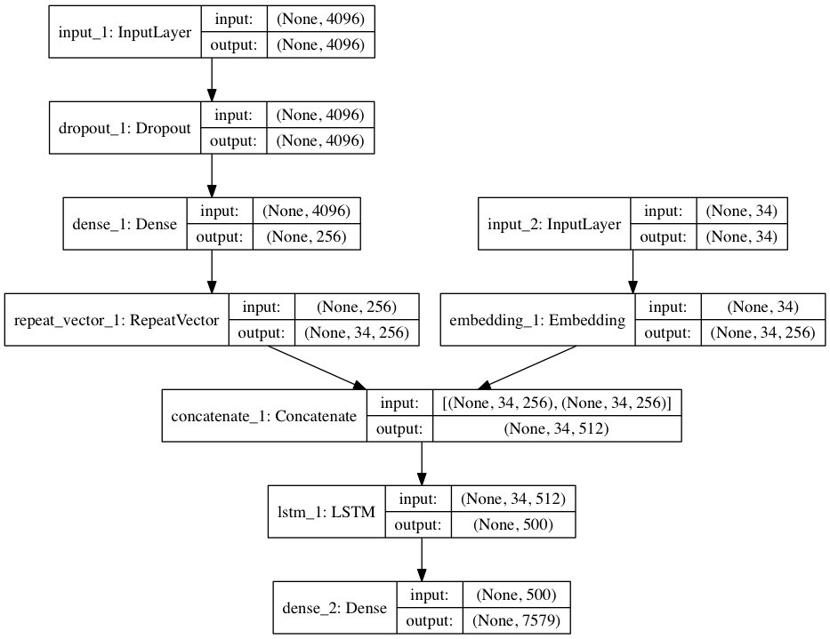

# Image Captioning (`Vision to Text`)


---

## Description


- Model trained on dataset of size 9 GB+

- Number of parameters in the encoder model: 33675264

- Number of parameters in the decoder model: 78113381

- Total number of parameters: 111788645

- [Check out a detailed thread on this project](https://twitter.com/deependu__/status/1772598553757507758)

---

## Inspiration 👨🏻

- The project was inspired by a 6-year-old image captioning project by [Divyansh Garg](https://github.com/Div99).



- The original architecture used VGG along with LSTM attention in seq2seq fashion.

- Here's the github link of his project: [Image Captioning by Divyansh Garg](https://github.com/Div99/Image-Captioning/).

---

## Improvements and modifications: 🔩

- ### Handling image input: 🏞️
  - Original project utilized **VGG nets** for image processing.
  - I went forward with **ViTs (Vision transformers)** because of their recent success.
  - Also, ViTs were introduced in june 2020 only, and the original project is of 2018s.
  - Read the original Vision transformer paper. [Arxiv link for ViTs](https://arxiv.org/abs/2010.11929)

- ### Caption Generator decoder: ✍🏻
  - Original project used LSTM with attention (probably, **Bahdanau Attention**).
  - I utilized the `state of the art` **transformer decoder for caption generation with cross-attention layer utilizing ViTs output contextual image patches embedding**.


#### In simple terms:


- The architecture I utilized was a vision transformer combined with a caption decoder.
- Images were passed through Vision transformer encoder.
- Encoder outputs were the contextually aware patch embedding of the image.
- These embeddings were then passed to caption gen decoder.

---

## How I handled datasets?

- Dataset I was willing to use was Kaggle Flickr image dataset: 
- [Kaggle Image captioning dataset](https://kaggle.com/datasets/hsankesara/flickr-image-dataset)

- But, the dataset is of 9 GB+. 
- So, I had to use an EC2 to get data from Kaggle and then upload it to AWS S3.
> Couldn't find streaming feature in kaggle dataset api.

- Here's a small script I utilized:

```py
import boto3
import os
from os import walk

s3 = boto3.client("s3")

image_folder = "flickr30k_images"

file_name = "results.csv"
destination = "datasets"

for idx, (dirpath, dirnames, filenames) in enumerate(walk(image_folder)):
    for idy, file_name in enumerate(filenames):
        print("\n" + "-" * 70)
        print(f"{idy=}")
        file_name = os.path.join(image_folder, file_name)
        s3_path = os.path.join(destination, file_name)
        print(f"uploading to s3 path: {s3_path}")
        print(f"uploading file: {file_name}")
        s3.upload_file(file_name, "deependu-my-personal-projects", s3_path)
print("done")
```

- Read more about my [EC2 to S3 data preparation](./model/ec2-to-s3-data-preparation/)

---

## Final Boss level challenge: 🤺🥷🏻😱

- Now, the one last boss-level challenge was to **`train the model with 175k+ images-caption pair`**.

- Training such a model on my personal Mac was almost infeasible and very-very time consuming.
- So, training should take place on cloud.
- But, even on cloud, such a large model with 100 million+ parameters and 175k+ image-caption pairs was a really challenging task.

- So, we definitely needed **Distributed training** to train the model.

- For the distributed training, I also needed to get my hands dirty with DDP (distributed data parallel) in pytorch.

- ##### Distributed training backpropagation


- So, made myself comfortable with AWS sagemaker, boto3, and pytorch distributed training.

- Now, I had everything, model to be trained, dataset, and distributed training knowledge.

---

## I, then finally started training:


- #### Distributed training job 🧑🏻‍🌾


- on AWS sagemaker in 3 instances with 24 NVIDIA A100 GPUs for 200 epochs
- Took almost 8 hours to train the model
---

## Machine model was trained on (`ml.p4d.24xlarge`)


<br/>


---
- Here are some counts on the number of parameters trained:
  - Number of parameters in the encoder model: 33,675,264
  - Number of parameters in the decoder model: 78,113,381
  - Total number of parameters: 111 million+

- I deployed the trained model as an AWS sagemaker endpoint for inferencing. 
- I serialized my image and then made a request to the endpoint and boom 💥.
- I can't believe I made this. This feeling was awesome. 🤩

- But, this feeling was short-lived.

---

# Bill for the training job


- I checked the aws bill, and it was.... 😱

- I admit, I panicked. I deleted everything that - I possibly could at that time.

- I had received AWS credit in the past and so was chill regarding the bill, but this was beyond.

---

### What was the Original plan?

- The original plan was to integrate the model with [Next Js](./) frontend & [FastAPI](./) backend, containerize both of them and then use GitHub-actions for CI/CD, and deploy on  AWS ECS (elastic container service) with autoscale and load-balancing.

---

### Finally,

- So, this was the whole journey. Full of downs & downs, and a small up and then again down. 🤡😎

But, it was fun and irritating doing all this. Hope you'd fun along the way.

---

## Thanks you for reading (if you actually did 🤗)