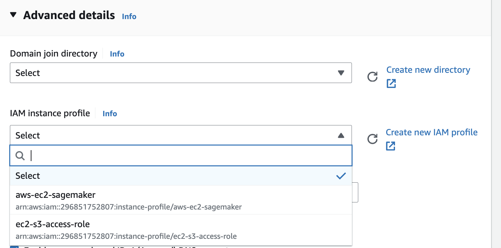

# Upload kaggle dataset to S3 bucket using EC2 instance 🤴🏻

1. Create an S3 bucket in your AWS account.
2. Create an EC2 instance and attach a role that has permission to access the S3 bucket (`advanced details while creating EC2 instance`).

3. Install the kaggle CLI on the EC2 instance.
```bash
pip install kaggle
```
1. Store authentication key in EC2: [kaggle api docs](https://www.kaggle.com/docs/api)
2. Sample api key stored:
```bash
ubuntu@ip-172-31-88-59:~$ cat .kaggle/kaggle.json
{"username":"deependu__","key":"YOUR_API_KEY"}
```
1. Download dataset from kaggle:
```bash
kaggle datasets download -d adityajn105/flickr8k
```
1. Once data is downloaded on EC2, extract the zip.
```bash
sudo apt install unzip
unzip flickr-image-dataset.zip -d ~/image-caption-dataset
```
1. Upload the extracted dataset to AWS S3.
```python
import boto3
import os
from os import walk

s3 = boto3.client("s3")

image_folder = "flickr30k_images"

file_name = "results.csv"
destination = "datasets"

for idx, (dirpath, dirnames, filenames) in enumerate(walk(image_folder)):
    for idy, file_name in enumerate(filenames):
        print("\n" + "-" * 70)
        print(f"{idy=}")
        file_name = os.path.join(image_folder, file_name)
        s3_path = os.path.join(destination, file_name)
        print(f"uploading to s3 path: {s3_path}")
        print(f"uploading file: {file_name}")
        s3.upload_file(file_name, "deependu-my-personal-projects", s3_path)
print("done")
```

9. Verify the dataset is uploaded to S3 bucket.

---

## One issue that caused a lot of headache 🤯


- Data was mostly clean, but one of the caption was missing in the csv file, which caused a lot of issues while tracking.

- So, that row was removed from the csv file. and the updated csv file was uploaded to S3.

- Here's the jupyter notebook that was used to remove the row and make some minor changes to the csv file: [notebook link](./main.ipynb)